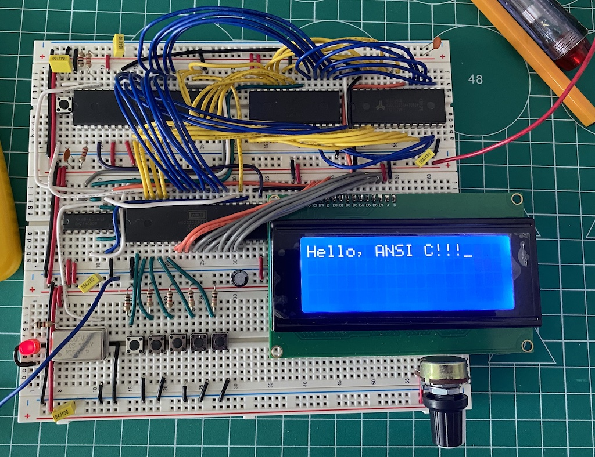

# Using ANSI C with Ben Eater 6502 computer



## How to build

1. First we need to pull `cc65` compiler repository:
```bash
git pull --recurse-submodules
```

2. Then we need to compile `cc65` (requires standard devtools):
```bash
cd cc65
make
cd ..
```

3. Next you can use `cc65` to compile code in this repository. But first we need to build C Runtime for Ben's computer:
```bash
make mkruntime
```

4. Finally build the project:
```bash
make all
```

5. Upload the created ROM image to the computer, e.g. using minipro:
```bash
minipro -p AT28C256 -w ./build/rom.image
```

:tada: Profit :tada:

Most of this code is based on this great reference [cc65.github.io/doc/customizing.html](https://cc65.github.io/doc/customizing.html).

## References

- [eater.net/6502](https://eater.net/6502)
- [github.com/cc65/cc65](https://github.com/cc65/cc65)